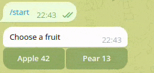
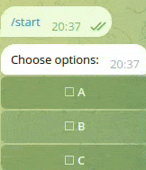
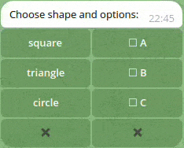

  <h1><code>teloxide-inline-widgets</code></h1>

  
  
  
  

The library for (*easy*?) creation of the inline-keyboard widgets for the [`teloxide`](https://github.com/teloxide/teloxide) framework.

There're some [examples](examples/README.md) available!

## Available widgets
### Radio List

### Checkbox List

## Others
One of the most desired thing is to combine widgets together. Currently, the library supports the simple `Layout` method which allows to combine `base-widgets` within single keyboard.

## Roadmap
- [ ] Simplify API with `proc-macros`
- [ ] Pagination mechanism
- [ ] Add `date-picker` widget
- [ ] Add custom callbacks to some actions
- [ ] Add ability to allow custom limitations to widgets