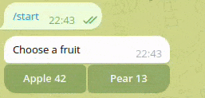
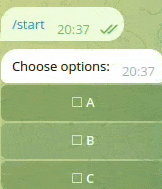
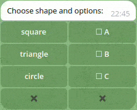

# Available examples

Before running any example set up `TELOXIDE_TOKEN` and `RUST_LOG=info` environment variables.

## RadioList example
```
cargo run --release --example radio_list
```



## CheckboxList example
```
cargo run --release --example checkbox_list
```



## Multiple Widgets example
```
cargo run --release --example multiple_widgets
```
